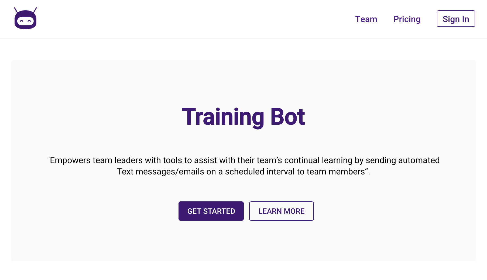
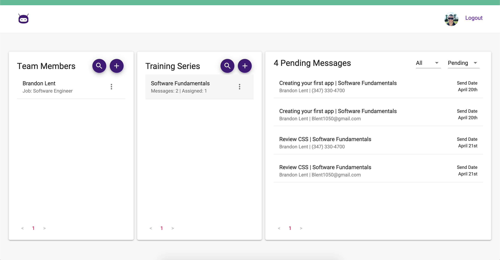
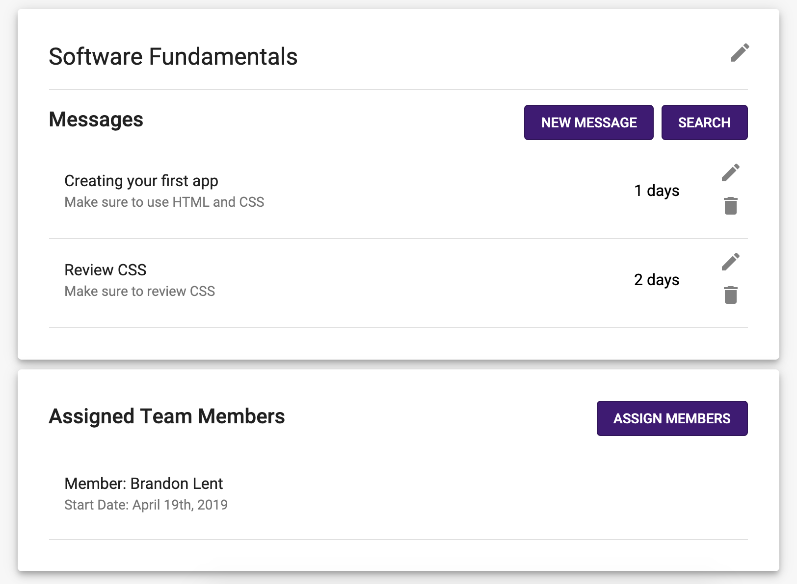

# 
# Training Bot
<table>
<tr>
<td>
  A single page application using the Twilio API to send automated text and email notifications. Training Bot assists team leaders by sending automated notifications with custom content to their team. 
</td>
</tr>
</table>

## Demo
Here is a working live demo:  https://trainingbot.netlify.com

## Site

### Dashboard
The central location of our App. Here you can see all of your team members, training series, and outgoing/sent messages.

### Team Members
You'll store all of your members here. This information will be used to send the notification to that specific member.

### Training Series
Training Series contains all of your content and assigned members.

### Profile
The profile section is where you can view/delete your account as well as upgrade your account.

## Mobile support
Training Bot is compatible with devices of all sizes and all OS's.

## [Usage](https://trainingbot.netlify.com) 

### Development

- Fork the repository
- Create a new branch (`git checkout -b improve-feature`)
- Make the appropriate changes in the files
- Add changes to reflect the changes made
- Commit your changes (`git commit -am 'Improve feature'`)
- Push to the branch (`git push origin improve-feature`)
- Create a Pull Request 

### Bugs

If you find a bug (the website couldn't handle the query and / or gave undesired results), kindly open an issue by emailing trainingbotlabs11@gmail.com including your search query and the expected result.

## Tech Used  

- [React](https://reactjs.org/)
- [Redux](https://redux.js.org/)
- [Node/Express](https://nodejs.org/en/)
- [Twilio/Sendgrid](https://www.twilio.com/)
- [Auth0](https://auth0.com/)
- [Stripe](https://stripe.com/)
- [Material-UI](https://material-ui.com/)

## Team

|  |  |  |  |  |
| ------------------------------------------------------------------------------------------------------ | ----------------------------------------------------------------------------------------------------------- | ----------------------------------------------------------------------------------------------------------- | ------------------------------------------------------------------------------------------------------------ | --------------------------------------------------------------------------------------------------------------- |
| [Alex King](https://github.com/Alex-AK)                                                                | [Brandon Lent](https://github.com/Blent1050)                                                                | [Leigh-Ann Friedel](https://github.com/lafriedel)                                                           | [Michael Landers](https://github.com/mlanders)                                                               | [Nathan Boyette](https://github.com/nateboyette)                                                                |

## [License](LICENSE)

MIT © [Training Bot ](https://github.com/training-bot/labs11-trainingBot-FE)
